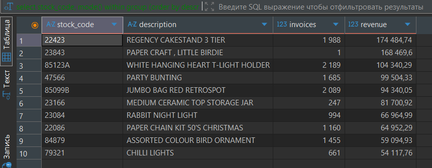
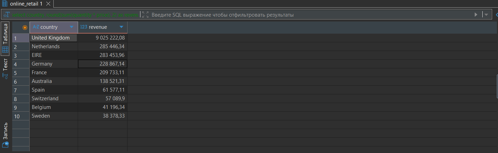
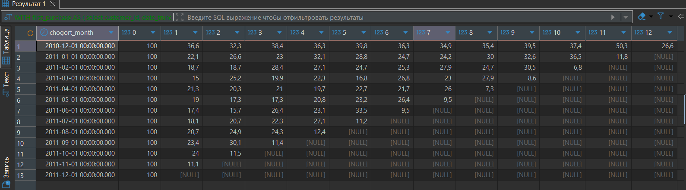
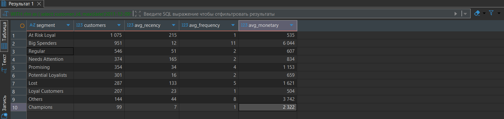
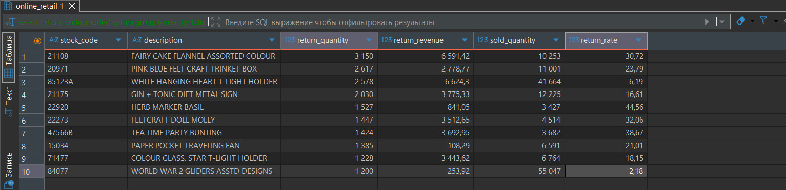

# online-retail-analysis
### Анализ транзакций продаж британского интернет-магазина (2009–2011)

**Стек:** PostgreSQL 15 · Docker · DBeaver

## Данные
[Online Retail II UCI](https://www.kaggle.com/datasets/mashlyn/online-retail-ii-uci)
Датасет содержит данные: розничные покупатели с частыми мелкими заказами и значительная часть оптовые клиенты с редкими но крупными заказами.

## Анализ

### 1. Общий обзор продаж
#### Выручка по месяцам

Типичная сезонность - пик продаж в ноябре, провал в декабре 2011 - объясняется границей датасета (данные обрезаны 9 декабря 2011).

#### Топ-10 товаров по выручке, по количеству заказов и странам.

Лидер продаж — REGENCY CAKESTAND 3 TIER.
Великобритания генерирует 85% выручки. Нидерланды и Ирландия - зарубежные рынки с выручкой выше 280K.

### 2. Когортный анализ

После первой покупки retention падает до 15–36% — это нормально для розничного e-commerce.
Декабрьская когорта показывает наиболее стабильное удержание ~35–40% на протяжении года, что может указывать на долю оптовых или лояльных клиентов.
Последние когорты (октябрь–декабрь 2011) обрезаны границей датасета и не отражают реальный retention.

### 3. RFM-сегментация

Датасет содержит смешанную базу: розничные клиенты с высокой частотой мелких заказов и оптовые покупатели с редкими крупными заказами. Стандартная RFM сегментация была адаптирована с учётом этой особенности, выделен отдельный сегмент Big Spenders.
Ключевые сегмены:
* Big Spenders - оптовые покупатели (951 клиент), редкие но крупные заказы, avg monetary 6044, покупали 12 дней назад;
* Champions - розничные покупатели (99 клиентов), avg monetary 2322, покупали 7 дней назад; 
* At Risk Loyal - основной риск (1075 клиентов), исторически активные, но не возвращаются (средний recency 215 дней).

### 4. Анализ возвратов

| Метрика | Результат |
|---|---|
| % заказов | 17.39% |
| % выручки | 8.43% |
| % клиентов | 36.62% |

Каждый третий клиент делал возврат, однако это составляет лишь 8.43% выручки, т.е возвращают преимущественно недорогие товары.
Товары с наибольшим return_rate (> 30%): текстиль и мелкие сувениры.

## Выводы

1. **Сезонность** - ноябрь критичен для выручки, февраль стабильно слабый месяц;
2. **Retention** - 15–36% возвращаются после первого заказа, основная проблема разовые покупатели;
3. **Сегментация** - два типа клиентов с разным поведением: оптовики и розница, требуют разных стратегий удержания;
4. **Возвраты** - необходим фокус на проблемных товарах с return_rate > 30%.
