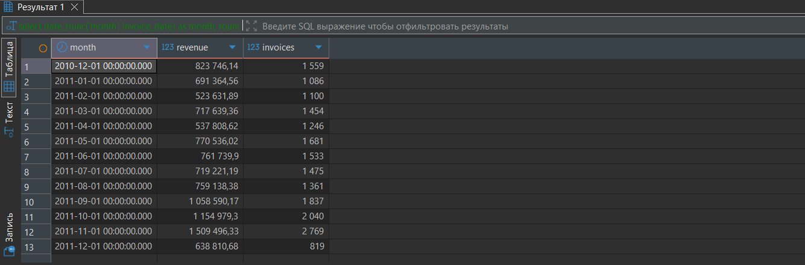

# online-retail-analysis
### Анализ транзакций продаж британского интернет-магазина (2009–2011)

**Стек:** PostgreSQL 15 · Docker · DBeaver

## Данные
[Online Retail II UCI](https://www.kaggle.com/datasets/mashlyn/online-retail-ii-uci)
Датасет содержит данные: розничные покупатели с частыми мелкими заказами и значительная часть оптовые клиенты с редкими но крупными заказами.

## Анализ

### 1. Общий обзор продаж

Типичная сезонность - пик продаж в ноябре-декабре, провал в январе-феврале.
